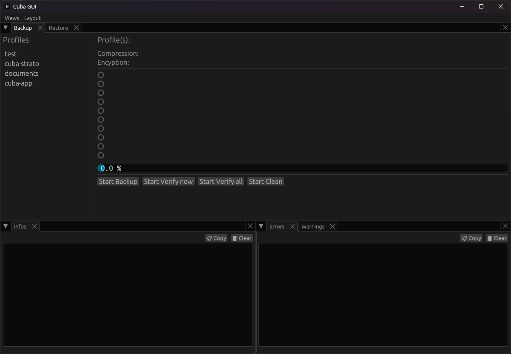

# Cuba GUI 

Cuba is a lightweight and flexible backup tool for your local data. It allows you to back up files to **WebDAV** cloud or network drives while keeping them in their original form by default. Optional **compression** and **encryption** ensure your backups are efficient and secure, and because standard formats are used, your files can also be accessed or restored with public tools if needed.

For further information, see [Workspace README](../README.md)

## Screenshots

## License

See [Workspace README](../README.md).

## Third-party assets

This project bundles the **JetBrains Mono** font.

JetBrains Mono is licensed under the SIL Open Font License 1.1.
Copyright © 2020 JetBrains s.r.o.

See `assets/fonts/OFL.txt` for details.